# Prompt Generation Guide for Scopecraft Mode System

This guide explains how to create effective prompts for the Scopecraft mode system, replacing the older command-based approach with a more flexible, context-aware system.

## Core Philosophy

### From Commands to Modes

We're moving from prescriptive commands ("do these steps") to adaptive modes ("achieve this outcome"). This shift enables:
- **Tool-agnostic prompts** that work with any AI system
- **Strategic guidance** with tactical autonomy
- **Context-rich interactions** leveraging the knowledge system
- **Team-based thinking** for better task allocation

### The Channelcoder Pattern

Our prompt system uses a flexible template approach:
```bash
channelcoder .tasks/.modes/{mode}/{template}.md \
    -d variable1="value1" \
    -d variable2="value2" \
    -d variable3="value3"
    # ... as many variables as needed
```

This pattern allows:
- Unlimited variable injection
- Runtime context customization
- Separation of structure and content
- Easy prompt evolution

## The 5W+H Framework

Every prompt should address these dimensions, with mode-specific emphasis:

### WHO - Identity & Expertise
```markdown
You are in {mode} mode with {expertise} expertise.
You're part of the {team} team working on {area}.
```

**Team-based thinking example:**
```markdown
You are part of the CLI team. The MCP team handles protocol changes.
If you discover MCP issues, document requirements for the MCP team.
```

### WHAT - Scope & Objectives
```markdown
## Your Mission
{primary_objective}

## Scope
- Focus: {specific_focus_areas}
- Boundaries: {what_not_to_do}
```

### WHY - Purpose & Context
```markdown
## Context
{business_motivation}
{technical_background}
{impact_description}
```

### HOW - Approach & Constraints
```markdown
## Approach
{strategic_guidelines}

## Constraints
{quality_standards}
{technical_limitations}
```

### WHERE - Location & Boundaries
```markdown
## Working Context
- Area: {technical_area}
- Codebase: {relevant_modules}
- Knowledge: {patterns_to_reference}
```

### WHEN - Temporal Context
```markdown
## Temporal Context
- Dependencies: {what_must_be_complete_first}
- Current state: {is_blocked_or_active}
- Urgency: {if_time_sensitive}
```

## Universal Requirements

### Always-Enforced Behaviors

Regardless of mode, team, or expertise, ALL prompts must include these requirements:

```markdown
<universal_requirements>
## Required Actions

### 1. Work Documentation
After completing any significant work:
- Update the task's Log section with a detailed summary
- Include: What was done, key decisions, blockers encountered
- Format: `- [Date]: [Summary of work and decisions]`

### 2. Progress Tracking
Throughout your work:
- Update task checklists as items are completed
- Mark subtasks with [x] when done
- Update task status if it changes (blocked, completed, etc.)

### 3. Decision Recording
When making technical or design decisions:
- Document the decision and rationale
- Note alternatives considered
- Flag decisions needing human review

### 4. Team Communication
For work affecting other teams:
- Create clear handoff documentation
- Document integration points
- Note dependencies or blockers for other teams

### 5. Knowledge Capture
When discovering patterns or insights:
- Document reusable patterns
- Note potential improvements
- Identify technical debt

### 6. Final Report Generation
Before completing any session:
- Generate a comprehensive work report
- Include all changes made
- List any follow-up tasks needed
- Update all relevant task sections
</universal_requirements>
```

### Implementation in Composition

These universal requirements are automatically included in every composed prompt:

```markdown
# {mode} Mode: {focus}

<role>...</role>
<context>...</context>
<mission>...</mission>

<!-- ALWAYS INCLUDED -->
<universal_requirements>
{content_from_universal_requirements.md}
</universal_requirements>

<deliverable_format>
In addition to mode-specific deliverables, always provide:
- Detailed work log entry
- Updated task status/checklists
- Decision documentation
- Team handoff notes (if applicable)
</deliverable_format>
```

## Prompt Composition System

### Layered Composition Pattern

Prompts are composed by layering different instruction sets:

```
Base Mode Instructions
    +
Team-Specific Instructions  
    +
Expertise-Specific Instructions
    +
Task-Specific Context
    =
Complete Prompt
```

### Composition Example

```bash
# Variables passed to channelcoder
channelcoder .tasks/.modes/compose.md \
    -d mode="research" \
    -d team="ui" \
    -d expertise="ux-researcher" \
    -d focus="user-onboarding" \
    -d deliverable="usability-findings"
```

This would compose:
1. Base research mode instructions
2. UI team context and boundaries
3. UX researcher expertise layer
4. Specific focus area
5. Expected deliverable format

### Modular Instruction Files

```
.tasks/.modes/
├── universal/
│   └── requirements.md   # ALWAYS included in every prompt
├── base/
│   ├── exploration.md     # Base exploration instructions
│   ├── implementation.md  # Base implementation instructions
│   └── research.md       # Base research instructions
├── teams/
│   ├── ui.md            # UI team specifics
│   ├── core.md          # Core team specifics
│   └── mcp.md           # MCP team specifics
├── expertise/
│   ├── ux-researcher.md  # UX research methods
│   ├── security-expert.md # Security focus
│   └── performance-engineer.md
└── compose.md           # Composition template
```

### Practical Composition Approach

Instead of complex includes, channelcoder would concatenate instruction files:

```markdown
# {mode} Mode: {focus}

<!-- From base/{mode}.md -->
<base_instructions>
{base_mode_content}
</base_instructions>

<!-- From teams/{team}.md -->
<team_context>
{team_specific_content}
</team_context>

<!-- From expertise/{expertise}.md -->
<expertise_layer>
{expertise_specific_content}
</expertise_layer>

<!-- Task-specific additions -->
<specific_context>
<focus>{focus}</focus>
<deliverable>{deliverable}</deliverable>
{if:additionalInstructions}
<additional>{additionalInstructions}</additional>
{/if}
</specific_context>
```

### Real-World Composition Examples

#### Example 1: UX Researcher in UI Team
```markdown
<composed_role>
You are in research mode with UX researcher expertise.
You're part of the UI team working on user experience.
You specialize in usability testing, user interviews, and behavioral analysis.
</composed_role>

<composed_context>
<team_boundaries>
Your UI team owns:
- User interface components
- Design systems
- User interaction flows

You interface with:
- Core team: For feature capabilities
- API team: For data requirements
</team_boundaries>

<expertise_context>
As a UX researcher, you focus on:
- User behavior patterns
- Pain points and friction
- Task completion rates
- Accessibility concerns
</expertise_context>
</composed_context>

<composed_mission>
Research user onboarding experience to identify friction points.

Deliverable: Usability findings report including:
- Key pain points with severity ratings
- User journey map with dropout points
- Specific recommendations for UI team
- Handoff notes for other teams
</composed_mission>
```

#### Example 2: Security Expert in Core Team
```markdown
<composed_role>
You are in implementation mode with security expert specialization.
You're part of the core team working on business logic.
You focus on threat modeling, secure coding, and vulnerability prevention.
</composed_role>

<composed_context>
<team_boundaries>
Your core team owns:
- Business logic
- Data models
- Core algorithms

Security interfaces with all teams:
- Auth team: Authentication patterns
- API team: Endpoint security
- UI team: Client-side security
</team_boundaries>

<expertise_context>
As a security expert, you consider:
- OWASP Top 10 vulnerabilities
- Data encryption requirements
- Access control patterns
- Audit logging needs
</expertise_context>
</composed_context>
```

## Prompt Structure Templates

### Base Template Structure

```markdown
---
mode: {mode_name}
expertise: {expertise_type}
team: {team_assignment}
---

# {Mode} Mode: {Task or Objective}

<role>
{who_what_why_establishment}
</role>

<loaded_context>
<task>
{task_content_if_applicable}
</task>

<knowledge>
{auto_loaded_patterns}
{relevant_decisions}
</knowledge>

<team_boundaries>
{team_context}
{collaboration_points}
</team_boundaries>
</loaded_context>

<mission>
{strategic_objective}
</mission>

<approach>
{how_to_think_about_this}
</approach>

<success_criteria>
{measurable_outcomes}
</success_criteria>

<deliverable_format>
{expected_output_structure}
</deliverable_format>

<team_coordination>
{when_to_handoff}
{what_to_document_for_others}
</team_coordination>
```

### Mode-Specific Templates

#### Exploration Mode
```markdown
<mission>
Investigate and understand {topic} deeply. 

You have the freedom to:
- Research broadly
- Identify patterns
- Document surprises
- Form hypotheses

Focus on understanding WHY, not just WHAT.
</mission>

<team_context>
As part of the research team, your findings will inform:
- Design team's technical decisions
- Implementation team's approach
- Testing team's strategies
</team_context>
```

#### Implementation Mode
```markdown
<mission>
Implement {feature} as part of the {team} team.
</mission>

<team_boundaries>
- Your team owns: {team_responsibilities}
- Other teams handle: {other_team_areas}
- Handoff points: {integration_boundaries}
</team_boundaries>

<approach>
Follow established patterns while maintaining team consistency.
Document decisions that affect other teams.
</approach>
```

#### Planning Mode
```markdown
<mission>
Break down {feature} into manageable work packages.
</mission>

<team_allocation>
Consider which team should own each piece:
- CLI team: Command interface changes
- Core team: Business logic
- MCP team: Protocol updates
- UI team: User interface components

Create tasks that respect team boundaries.
</team_allocation>
```

## Context Integration Patterns

### Layered Context Loading

```markdown
## Context Layers

### Core Context (Always Loaded)
- Task: {current_task}
- Mode: {active_mode}
- Team: {team_assignment}

### Direct References
{entities_mentioned_in_task}

### Related Context (1-hop)
{patterns_used_by_references}
{decisions_affecting_area}

### Discovery Context (As Needed)
{semantically_similar_work}
{historical_approaches}
```

### Knowledge System Integration

```markdown
<knowledge_context>
## Relevant Patterns
{patterns_from_knowledge_base}

## Architectural Decisions
{ADRs_affecting_this_work}

## Team Conventions
{team_specific_standards}
</knowledge_context>

<freeform_context>
## Additional Context
{natural_language_notes}
{historical_context}
{team_preferences}
{gotchas_and_warnings}
</freeform_context>
```

## Variable Schema Examples

### Basic Mode Variables
```yaml
mode: exploration|planning|design|implementation|diagnosis|evolution
expertise: researcher|architect|developer|tester|analyst
team: cli|core|mcp|ui|infrastructure|docs
taskId: optional_task_reference
additionalInstructions: freeform_guidance
```

### Context Variables
```yaml
# Scope variables
area: auth|billing|dashboard|api
module: specific_code_module
patterns: [relevant_patterns]

# Temporal variables  
dependencies: [tasks_that_must_complete_first]
currentState: blocked|active|pending
urgency: normal|high|critical

# Team variables
primaryTeam: owning_team
collaboratesWith: [other_teams]
handoffTo: next_team_in_workflow
```

### Quality Variables
```yaml
autonomyLevel: autonomous|guided|collaborative|manual
riskTolerance: low|medium|high
qualityBar: prototype|production|critical
reviewRequired: boolean
```

### Template Variables
```yaml
# Document templates
documentTemplate: path_to_template_file
sectionInstructions: detailed_instructions_per_section
tocStructure: table_of_contents_outline

# Code templates
codeGuidelines: path_to_coding_standards
architecturePattern: mvc|microservice|modular
testingApproach: unit|integration|e2e

# Deliverable specifications
deliverableFormat: document|code|api|design
outputStructure: expected_file_structure
qualityChecklist: completion_criteria
```

## Parallel Work and Human-in-the-Loop Design

### Core Principle: Split for Parallelism

The key to saving human time is breaking work into smaller, independent steps that can run in parallel as background tasks. Each step:
- Writes results back to its task
- Waits for human review/input if needed
- Enables other work to continue meanwhile

#### Traditional Approach (Blocking)
```
Start → Do Everything → Wait for Human → Continue
        [Human waits]                    
```

#### Scopecraft Approach (Non-blocking)
```
Start → Step 1 → Write Results → Human Reviews (when available)
      ↘ Step 2 → Write Results ↗
      ↘ Step 3 → Write Results ↗
```

### Implementation Pattern

Instead of one monolithic prompt:
```markdown
<!-- DON'T DO THIS -->
<monolithic_task>
Research OAuth options, design the system, implement it, 
test it, and document everything.
</monolithic_task>
```

Break into parallel-friendly steps:
```markdown
<!-- DO THIS -->
<step_1_research>
Research OAuth providers and patterns.
Write findings to task deliverable.
End with questions for human review.
</step_1_research>

<step_2_ux_design>
Design user flow for OAuth.
Can run parallel to research.
Write mockups to task deliverable.
</step_2_ux_design>

<step_3_api_design>
Design OAuth API endpoints.
Depends on research findings.
Write spec to task deliverable.
</step_3_api_design>
```

### Background Task Execution

```bash
# Run multiple explorations in parallel
channelcoder scripts/prompts/explore-idea.md -d idea="OAuth integration" &
channelcoder scripts/prompts/explore-idea.md -d idea="Performance monitoring" &
channelcoder scripts/prompts/explore-idea.md -d idea="Email notifications" &

# Human can review results asynchronously
# Each exploration writes to its own task
# No blocking, maximum parallelism
```

### Human Review Points

Each step should create clear review points:

```markdown
<step_completion>
## Step Complete: Research Phase

### What I Found
[Research summary]

### Decisions Needed
1. Should we use OAuth2 or SAML?
2. Which providers to support initially?

### Next Steps (Awaiting Approval)
- Design authentication flow
- Create API specifications

**Status**: Waiting for human review
**Continue**: Reply to this task to proceed
</step_completion>
```

### Benefits of This Approach

1. **Time Efficiency**: Human doesn't wait for long-running tasks
2. **Parallelism**: Multiple investigations run simultaneously  
3. **Flexibility**: Human can review in any order
4. **Continuity**: Work documented in tasks, easy to resume
5. **Quality**: More frequent checkpoints mean fewer wrong turns

## Autonomous vs Interactive Prompts

### Two Execution Modes

Scopecraft supports both autonomous and interactive prompt patterns:

#### Autonomous Prompts
Located in `scripts/prompts/`, these run independently:
```bash
channelcoder scripts/prompts/explore-idea.md \
    -d ideaDescription="Add OAuth support"
```

Characteristics:
- Complete execution without human intervention
- Generate comprehensive reports
- Update task systems automatically
- Ideal for: research, analysis, planning

#### Interactive Prompts  
Used within modes for ongoing collaboration:
```bash
channelcoder .tasks/.modes/implement/base.md \
    -d mode="ui" \
    -d taskId="AUTH-001"
```

Characteristics:
- Human-in-the-loop checkpoints
- Iterative refinement
- Real-time decision making
- Ideal for: implementation, debugging, design

### The Planning Pattern

Planning is fundamental to effective AI work at both micro and macro levels:

#### Micro-Level (Within Tasks)
```markdown
<planning_protocol>
1. Before starting work:
   - Create a detailed plan
   - Use TodoWrite to track steps
   - Get human approval if needed

2. Execute systematically:
   - Work through todos sequentially
   - Update progress in real-time
   - Document decisions made
</planning_protocol>
```

#### Macro-Level (Across System)
```
Research Task → UX Design Task → API Design Task → Implementation Tasks
     ↓                ↓                ↓                    ↓
  Findings      Mockups/Flows    Specifications      Working Code
```

This separation enables:
- Specialized expertise per phase
- Clear handoffs between teams
- Parallel work where possible
- Quality gates at transitions

### Practical Parallelism Example

Consider exploring a new feature idea:

```bash
# Morning: Human kicks off parallel research
channelcoder explore-idea.md -d idea="Add real-time collaboration" &
channelcoder explore-competitors.md -d product="figma" &  
channelcoder explore-competitors.md -d product="miro" &
channelcoder research-tech.md -d tech="websockets vs SSE" &

# Human goes to meetings, does other work...

# Afternoon: Review all findings
sc task list --tag "exploration" --status "waiting-review"

# Each task has:
# - Comprehensive findings
# - Specific questions
# - Suggested next steps
# - No duplicate work
```

This is far more efficient than:
- Running each research task sequentially
- Sitting through long AI execution
- Losing context between sessions

### Sequential Thinking Pattern

The successful React generator prompt demonstrates key principles:

1. **Phased Approach**: Research → UX → Architecture → Implementation → Summary
2. **Task Isolation**: Each phase has its own task and todos
3. **Documentation Flow**: Each phase documents findings for the next
4. **Tool Integration**: Combines TodoWrite (micro) with task system (macro)

This pattern maps to Scopecraft's approach:
```markdown
<sequential_thinking>
Micro: Use TodoWrite within each task for step-by-step execution
Macro: Use task system to organize phases and handoffs

Benefits:
- No cognitive overload
- Clear progress tracking
- Easy to resume/handoff
- Natural checkpoints
</sequential_thinking>
```

## Advanced Composition Patterns

### Dynamic Expertise Combinations

Some tasks benefit from multiple expertise layers:

```bash
channelcoder .tasks/.modes/compose.md \
    -d mode="design" \
    -d team="api" \
    -d primaryExpertise="api-designer" \
    -d secondaryExpertise="security-expert" \
    -d focus="payment-endpoints"
```

Result: An API designer with security expertise designing payment endpoints.

### Conditional Composition

Templates can include conditional sections based on variables:

```markdown
<expertise_modifiers>
{if:secondaryExpertise}
Additionally, you bring {secondaryExpertise} perspective to this work.
{/if}

{if:riskLevel="high"}
<risk_considerations>
This is a high-risk area. Apply extra scrutiny to:
- Security implications
- Data integrity
- Rollback strategies
</risk_considerations>
{/if}
</expertise_modifiers>
```

### Cross-Team Collaboration Modes

When work spans teams, compose with collaboration focus:

```markdown
<collaboration_mode>
You're the {team} team representative in a cross-team effort.

Primary responsibility: {team_deliverable}
Collaboration points:
{foreach:collaboratingTeams as team}
- {team}: {team.handoff}
{/foreach}
</collaboration_mode>
```

### Expertise Gradient

Different levels of expertise for different contexts:

```markdown
<expertise_level>
{switch:expertiseLevel}
{case:"junior"}
You're learning {domain}. Ask questions when uncertain.
Focus on following established patterns.

{case:"senior"}  
You're experienced in {domain}. Make architectural decisions.
Document patterns for others to follow.

{case:"specialist"}
You're the {domain} expert. Challenge assumptions.
Establish new patterns when beneficial.
{/switch}
</expertise_level>
```

## Prompt Design Patterns

### Pattern 1: Question-First Approach

```markdown
<initial_questions>
Before diving into implementation, I need to understand:

1. [Clarifying question about scope]
2. [Question about constraints or preferences]
3. [Question about integration points]

Please provide answers or let me know if I should proceed with reasonable assumptions.
</initial_questions>
```

This pattern:
- Prevents wasted work on wrong assumptions
- Builds shared understanding early
- Creates natural checkpoint for human input
- Can be skipped with "proceed with assumptions" response

### Pattern 2: Team-Based Task Allocation

```markdown
## Team Responsibilities

You are part of the {primaryTeam} team. Your responsibilities:
{team_specific_duties}

When you encounter work for other teams:
1. Document it as a requirement
2. Create a handoff task
3. Don't attempt to implement it yourself

Example:
"This requires MCP protocol changes. Creating requirement for MCP team..."
```

### Pattern 2: Progressive Context Enhancement

```markdown
## Context Loading Strategy

Start with: {core_context}

If you need more context:
1. Follow entity references
2. Load related patterns
3. Check team knowledge base
4. Review historical decisions

Stop when you have enough to proceed.
```

### Pattern 3: Discovery Encouragement

```markdown
## Discovery Focus

While completing your primary mission:
- Note unexpected patterns
- Document team boundary issues  
- Identify reusable components
- Flag architectural concerns

These discoveries help all teams improve.
```

### Pattern 4: Checkpoint Protocol

```markdown
## Natural Checkpoints

After each major section:
1. Summarize progress
2. Identify assumptions
3. Note team handoffs needed
4. Flag decisions for review

This creates review opportunities without interrupting flow.
```

### Pattern 5: Question and Feedback Tools (Planned)

```markdown
<async_collaboration>
## Using Question Tool
When you need human input but can continue other work:
question_tool.ask({
  context: "Working on UI implementation",
  question: "Which framework should we use: React or Vue?",
  options: ["React", "Vue", "Let me decide based on research"],
  continueWithoutAnswer: true
})

## Using Feedback Tool  
When you discover issues for other teams:
feedback_tool.send({
  to: "API team",
  from: "UI team",
  issue: "GET /users endpoint needs pagination support",
  impact: "Can't implement infinite scroll without it",
  workaround: "Using client-side filtering for now"
})
</async_collaboration>
```

This enables:
- Non-blocking decision points
- Cross-team communication
- Human-in-the-loop without stopping progress
- Clear audit trail of decisions and feedback

### Pattern 6: Confidence Building Phase

```markdown
<confidence_building>
For complex or unfamiliar tasks, start in Q&A mode:

"Before I begin implementation, let me verify my understanding:
- The authentication should use JWT tokens, correct?
- We're integrating with the existing user service?
- Performance target is <100ms response time?

This is just for clarification - I won't make changes yet."
</confidence_building>
```

Benefits:
- Validates understanding before action
- Builds trust with human reviewer
- Identifies gaps in context early
- Prevents action-oriented misinterpretation
```

## Deliverable Specifications and Templates

### Core Principle: Structure Guides Quality

When expecting deliverables, provide clear structure and guidelines rather than vague instructions. This enables more generic prompts that can work across different contexts.

### For Code Deliverables

```markdown
<code_deliverable>
## Expected Code Structure
- Follow existing patterns in {area}
- Include comprehensive error handling
- Add unit tests for all public methods
- Document complex logic with comments
- Follow team coding standards

## Quality Guidelines
- Code must pass: bun run code-check
- Test coverage minimum: 80%
- Performance: No operations over 100ms
- Security: Input validation on all endpoints
</code_deliverable>
```

### For Document Deliverables

Provide templates with section instructions:

```markdown
<document_template>
# Technical Design Document

## 1. Executive Summary
[Instruction: 2-3 paragraphs summarizing the problem, solution, and impact]

## 2. Problem Statement  
[Instruction: Detailed description of the problem we're solving and why it matters]

## 3. Proposed Solution
[Instruction: High-level approach and key design decisions]

## 4. Technical Architecture
[Instruction: Components, data flow, integration points with diagrams if helpful]

## 5. Implementation Plan
[Instruction: Phases, milestones, dependencies]

## 6. Risks and Mitigations
[Instruction: What could go wrong and how we'll handle it]

## 7. Success Metrics
[Instruction: How we'll measure if this solution works]
</document_template>
```

### Template Loading Approaches

#### Approach 1: Direct Reference in Prompt
When the template is known and fixed:

```markdown
<expected_deliverables>
Load and complete @template/technical-design.md following these steps:

1. Read through all sections and instructions
2. For each section:
   - Plan how to address the instruction
   - Research/gather needed information
   - Write the section content
   - Verify it meets the instruction

3. After all sections:
   - Review for cohesiveness
   - Check cross-references
   - Ensure no gaps
</expected_deliverables>
```

#### Approach 2: Variable-Based Template
When the template needs to be determined programmatically:

```markdown
<expected_deliverables>
Complete the template at {documentTemplate} by:
- Following section instructions
- Maintaining consistent style
- Ensuring all required sections are filled
</expected_deliverables>
```

### When to Use Each Approach

**Use Direct References (@template/) when:**
- Template is fixed for this type of work
- Prompt is specific to a deliverable type
- You want AI to have full template context
- Template is checked into the repository

**Use Variables when:**
- Template varies based on conditions
- Non-AI scripts determine which template
- Building reusable/generic prompts
- Template path comes from configuration

### Template-Driven Benefits

1. **Consistency**: All deliverables follow same structure
2. **Completeness**: No important sections forgotten
3. **Quality**: Clear expectations per section
4. **Efficiency**: AI doesn't guess what's needed
5. **Reusability**: Same template works for similar tasks

### Example: API Design Template

```markdown
<api_design_template>
# API Design: {feature_name}

## Endpoints Overview
[List all endpoints with HTTP methods and brief descriptions]

## Detailed Specifications

### Endpoint: {method} {path}
**Purpose**: [What this endpoint does]
**Authentication**: [Required auth method]
**Request**:
```json
{
  // Example request body with comments
}
```
**Response**:
```json
{
  // Example response with all fields
}
```
**Errors**: 
- 400: [When/why this happens]
- 401: [When/why this happens]
- 404: [When/why this happens]

[Repeat for each endpoint]

## Data Models
[Define all data structures used]

## Integration Notes
[How this fits with existing APIs]
</api_design_template>
```

With this template, the AI can systematically work through each endpoint, ensuring nothing is missed.

### Real-World Example: PRD Generation

```markdown
<mission>
Create a Product Requirements Document for the OAuth feature.
</mission>

<expected_deliverables>
Load @template/PRD.md and complete it by:

1. For each section in the template:
   - Read the section instruction carefully
   - Plan what information you need
   - Gather context from tasks/knowledge
   - Write comprehensive content
   - Verify it answers the instruction

2. Ensure the document:
   - Flows logically from problem to solution
   - Includes all stakeholder perspectives
   - Has clear success metrics
   - Addresses risks and constraints

3. Final review:
   - Check all sections are complete
   - Verify internal consistency
   - Ensure terminology is consistent
   - Add cross-references where helpful
</expected_deliverables>
```

This approach lets the AI discover and work with the template naturally, without needing programmatic template injection.

## Best Practices

### 1. Use XML Tags for Structure
- XML tags provide meta-context to LLMs
- They help frame different types of information
- Use semantic tag names (e.g., `<mission>`, `<constraints>`, `<team_boundaries>`)
- Tags make prompt sections scannable and clear

### 2. Strategic Over Tactical
- Define outcomes, not steps
- Trust AI to find the path
- Provide constraints, not procedures

### 3. Team-Aware Design
- Clear team boundaries
- Explicit handoff points
- Shared vocabulary
- Cross-team documentation

### 4. Context Balance
- Enough to be effective
- Not so much to overwhelm
- Progressive loading options
- Clear relevance indicators

### 5. Flexibility First
- Support multiple approaches
- Allow for discovery
- Encourage adaptation
- Avoid rigid structures

### 6. Human Review Integration
```markdown
## Human Review Tracking

Document decisions needing review:
- [ ] Assumptions about {area}
- [ ] Team boundary interpretations
- [ ] Architectural choices
- [ ] Integration approaches
```

## Example: Complete Prompt Generation

### Scenario: Create OAuth Implementation Prompt

```bash
# Using channelcoder pattern
channelcoder .tasks/.modes/implement/base.md \
    -d mode="implementation" \
    -d expertise="security-focused developer" \
    -d team="auth" \
    -d taskId="implement-oauth-05A" \
    -d area="authentication" \
    -d collaboratesWith="ui,api" \
    -d sprint="2024-S1" \
    -d autonomyLevel="guided" \
    -d additionalInstructions="Focus on provider abstraction"
```

### Generated Prompt Structure:

```markdown
# Implementation Mode: OAuth Integration

<role>
You are in implementation mode with security-focused developer expertise.
You're part of the auth team working on authentication.
Task: implement-oauth-05A
</role>

<team_boundaries>
Your team (auth) owns:
- Authentication flows
- Token management  
- Provider integration

You'll collaborate with:
- UI team: Login component integration
- API team: Endpoint security
</team_boundaries>

<loaded_context>
<task>
[Task content for implement-oauth-05A]
</task>

<knowledge>
- Pattern: JWT token management
- Pattern: OAuth2 flow variations
- Decision: ADR-004 - Stateless authentication
</knowledge>

<temporal_context>
Dependencies: 
- Database schema must be updated first
- API endpoints design must be finalized
Current state: Active
</temporal_context>
</loaded_context>

<mission>
Implement OAuth2 authentication with focus on provider abstraction.
Autonomy: Guided (check in at major decision points)
</mission>

<success_criteria>
- [ ] Multiple provider support
- [ ] Secure token storage
- [ ] Clean handoff to UI team
- [ ] API team integration docs
</success_criteria>

<deliverable_format>
- Implementation code
- Integration guide for UI team
- API documentation for endpoints
- Security considerations doc
</deliverable_format>
```

## Migration from Old Commands

### Identifying Command Types

1. **Workflow Commands** → Specialized Modes
   - `/project:01_brainstorm` → Exploration mode with brainstorming template
   - `/project:02_proposal` → Planning mode with proposal template

2. **Technical Commands** → Implementation Modes
   - `/project:05_implement typescript` → Implementation mode with typescript expertise
   - `/project:test` → Diagnosis mode with testing focus

3. **Utility Commands** → Composite Modes
   - `/project:review` → Multiple modes (exploration + diagnosis)
   - `/project:integrate` → Evolution mode with integration focus

### Conversion Process

1. Extract the strategic intent from the command
2. Identify the appropriate mode(s)
3. Define team boundaries if applicable
4. Create variable schema for flexibility
5. Build template with proper context layers

## Future Enhancements

### Prompt Learning System
- Track which context was actually used
- Identify effective prompt patterns
- Suggest variable optimizations
- Build team-specific templates

### Context Optimization
- Measure token usage by section
- Identify high-value context
- Prune redundant information
- Cache common patterns

### Team Evolution
- Discover natural team boundaries
- Document handoff patterns
- Build team vocabularies
- Share effective practices

## Prompt Family Flow and Orchestration

### Visual Overview

The Scopecraft prompt system consists of sequential and parallel families that work together:

```mermaid
flowchart TB
    subgraph "Sequential Development Flow"
        B[🌱 Brainstorm] --> R[🔍 Research]
        R --> P[📋 Planning]
        P --> D[🏗️ Design]
        D --> I[💻 Implementation]
        I --> V[✅ Review]
    end
    
    subgraph "Parallel Execution"
        R -.-> R2[Multiple<br/>Research<br/>Tasks]
        I -.-> I2[Multiple<br/>Team<br/>Implementations]
    end
    
    subgraph "Independent Support"
        DG[🔧 Diagnosis]
        EV[🔄 Evolution]
    end
    
    DG -.-> B
    DG -.-> R
    DG -.-> P
    DG -.-> D
    DG -.-> I
    
    EV -.-> I
    EV -.-> V
```



### Prompt Family Reference Table

| Phase | Mode | Key Prompts | Purpose | Outputs |
|-------|------|-------------|---------|---------|
| **1** | **Brainstorming** | • `explore-idea.md`<br>• Question-first approach | Validate and expand ideas | Scoped concept |
| **2** | **Research** 🔀 | • `explore-competitors.md`<br>• `research-tech.md`<br>• Pattern discovery | Deep understanding | Findings & recommendations |
| **3** | **Planning** | • Task breakdown<br>• Team allocation<br>• Dependencies | Structure the work | Task hierarchy |
| **4** | **Design** | • `@template/technical-design.md`<br>• API specs | Technical decisions | Specifications |
| **5** | **Implementation** 🔀 | • Mode + Team + Expertise<br>• Code guidelines | Build solution | Working code |
| **6** | **Review** | • Completeness checks<br>• Quality validation | Ensure quality | Approval |

🔀 = Supports parallel execution

### Independent Modes

| Mode | Trigger | Key Prompts | Use Case |
|------|---------|-------------|----------|
| **Diagnosis** 🔧 | Issues arise | • Root cause analysis<br>• Performance profiling | Debug and fix |
| **Evolution** 🔄 | Code ages | • Refactoring<br>• Modernization | Improve existing |

### Orchestration Examples

#### Morning Research Burst
```bash
# Kick off parallel investigations
channelcoder explore-idea.md -d idea="real-time sync" &
channelcoder research-tech.md -d tech="CRDT vs OT" &
channelcoder explore-competitors.md -d product="figma multiplayer" &

# Review findings in afternoon
sc task list --tag "research" --status "complete"
```

#### Team-Based Implementation
```bash
# After design phase, teams work in parallel
channelcoder implement.md -d team="ui" -d task="AUTH-UI-001" &
channelcoder implement.md -d team="api" -d task="AUTH-API-001" &
channelcoder implement.md -d team="core" -d task="AUTH-CORE-001" &
```

## Summary

The new prompt generation approach emphasizes:
1. **Flexible templates** with unlimited variables
2. **Team-based thinking** for better task allocation
3. **Strategic guidance** over tactical instructions
4. **Rich context integration** from knowledge system
5. **Progressive enhancement** as patterns emerge

This system grows with your usage, supporting everything from simple tasks to complex multi-team workflows while maintaining the flexibility to adapt to new patterns and needs.